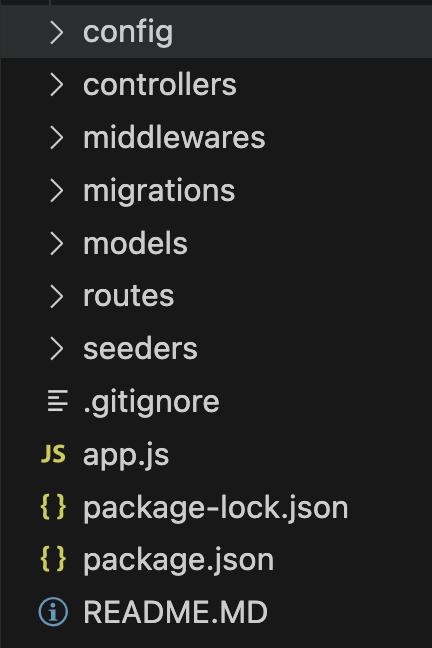

# IH Movie DB (IMDB)

Pada Tugas ini, kalian diminta untuk membuat server backend baru, dengan migration dilakukan secara manual menggunakan sequelize-cli dengan mengikuti arahan dari API-doc

## Requirement

### 1. Struktur folder

Pada project ini kalian diminta untuk memisahkan logic pada repository kode kalian seperti gambar di bawah ini.

- Folder config : berisi config setup database
- Folder controllers: berisi logic untuk memproses request dari client.
- Folder migrations : berisi historikal perubahan/penambahan/penghapusan table pada database
- Folder seeders : berisi logic untuk mengisi table pada database
- Folder models : berisi file yang merepresentasikan entitas table di database
- Folder routes : berisi file routing endpoint

### 2. ERD IMDB

nama table: Movie (Bisa plural/singular)
kolom:

- id : PRIMARY KEY DataTypes.INTEGER NOT NULL
- title: DataTypes.STRING, NOT NULL
- description: DataTypes.TEXT, NOT NULL
- createdAt DataTypes.DATE, NOT NULL
- updatedAt: DataTypes.DATE, NOT NULL

nama table: Review (Bisa plural/singular)
kolom:

- id : PRIMARY KEY DataTypes.INTEGER NOT NULL
- title: DataTypes.STRING, NOT NULL
- description: DataTypes.TEXT, NOT NULL
- rating: DataTypes.INTEGER NOT NULL
- movieId: DataTypes.Integer NOT NULL
- createdAt DataTypes.DATE, NOT NULL
- updatedAt: DataTypes.DATE, NOT NULL

### 3. ENDPOINT

Untuk detail endpoint requirement dapat dilihat pada folder assets/api-doc.md dan assets/imdb-api.postman_collection.json. Pastikan server kalian dapat berjalan sesuai dengan berkas tersebut.

### 4. MIGRATION

Pada requirement ini kalian diminta untuk melakukan migrasi database movie app menggunakan sequelize cli dan tidak diperbolehkan mengubah secara langsung table/kolom/tipe data melalui gui atau psql. Untuk detailnya akan dijelaskan oleh mentor dan berikut referensinya : https://sequelize.org/docs/v6/other-topics/migrations/

### 5. SEEDER

Kalian diminta untuk membuat seeder sejumlah 5 data movie menggunakan sequelize-cli.
reference: https://sequelize.org/docs/v6/other-topics/migrations/

### 6. Sequelize hooks n validation

Tambahkan fungsional pada models dengan hooks n validasi berikut:

-- kolom title

- tambahkan validasi hanya bisa menerima panjang string maksimal 255 karakter
- tambahkan validasi input tidak boleh null atau string kosong

-- kolom description

- tambahkan validasi input tidak boleh null atau string kosong

-- kolom rating pada table review

- tambahkan validasi input tidak boleh kurang dari 0 dan lebih dari 5

### 6. Sequelize Association

Tambahkan association pada models movie dengan review, dengan asumsi satu movie bisa punya banyak review
sehingga saat find si movie atau si review, akan eager loading data relation nya
